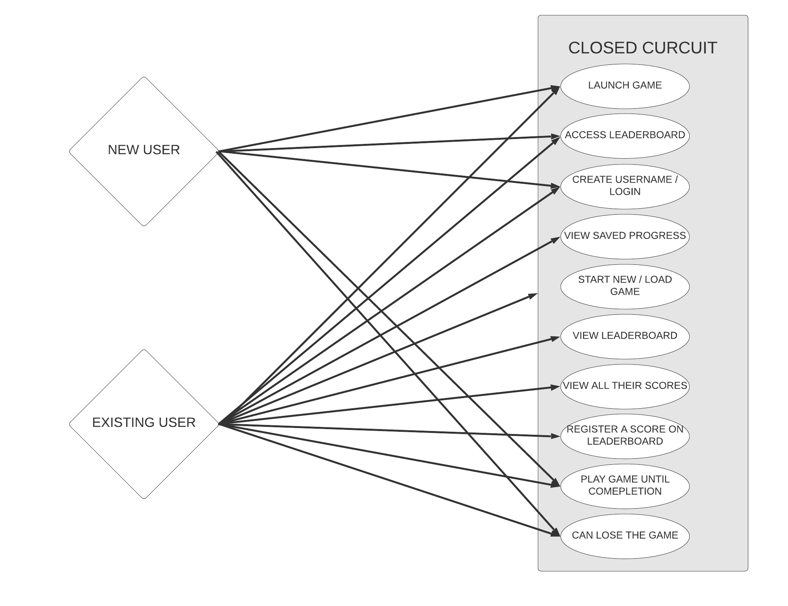

USER STORIES:  
As a player, I want a game that I can pick up at any time and play.  
As a player, I want a leaderboard where I can view other peoples scores and compare myself too.  
As a player, I want a game that I can stop / pause at any time and resume later. 
As a player, I want a game that I can play for as long / short as I want too. 

  
Given a new user, will be able to launch and start the game. 
Given a new user, will be able to access the leaderboard to view. 
Given a new user, will be able to create a username and login. 
Given an existing user, will be able to login and view saved progress. 
Given an existing user, will be able to start a new game or load an existing file. 
Given an existing user, will be able to view the leaderboard. 
Given an existing user, will be able to view all of their personal scores. 
Given an existing user, will be able to register a score on the leaderboard upon completing the game. 
Given any user, will be able to play the game until completion. 
Given any user, will be able to lose the game. 
  

UML (USE CASE DIAGRAM)

  

Requirement List: 
 
1. The system will prompt the user with the game screen upon loading. 
   - i. The user will have an option to login. 
        - a. If the user does not have a login, the user will be able to create one. 
        - b. If the user has a login, will have to option for the game to "remember" them. 
   - ii. The user will have an option to view the leaderboard. 
         - a. If logged in, the user can filter by their entries. 
         -b. If logged in or not, can filter list by user. 
   -iii. The user will have an option to start the game. 
         - a. User can place towers, and start waves manually. 
         - b. User can play to wave 50 and end, or go into endless mode. 
 - iv. Upon completing the game the game will prompt the user to upload their score. 
   - a. If logged in, user can choose to upload or not. 
   - b. If not logged in, the user can create a login and upload, or not. 
       
2. The system will store each score in the database by user, and run game logic. 
 - i. Given score from user will upload to database with username, score, and date/time. 
 - ii. Given request by user, will display scoreboard to users. 
   - a. Can filter by self, or search username. 
 - iii. Game will perform game logic each round the user plays. 
   - a. Enemy pathing. 
   - b. Tower AI and logic. 
   - c. Game logic with rounds and a "Game Over" and "Game Complete" state. 
 - iv. Will store general round information in a database. 
   - a. Enemy spawns, wave presets, point amounts on wave completion. 
  
3. The system will be developed with C#, SQL, and ASP.NET 
 - i. System will be hosted on Github, Azure, and have a client side application. 
    
    
